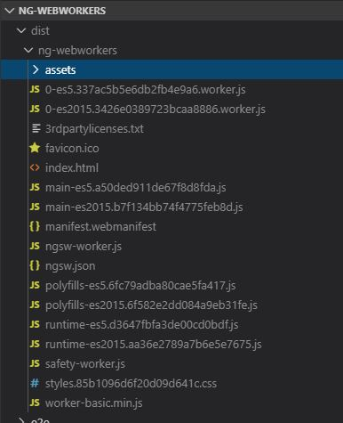
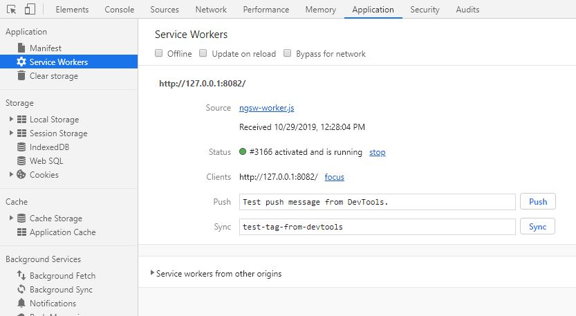

# NgWebworkers

- by Anthony Leotta
- I collected information from many web-pages to create this overview document.  I did not site my referneces but I included a list of them at the bottom of this document.

## What are Web Workers?

- JavaScript is a single-threaded language, meaning that all your operations are run by the very same thread.  If you perform compute intensive tasks on the thread, the rest of the tasks will have to way for those to be finished, leading to sloppy UI rendering and whatnot.
- Web workers are independent scripts that run in an isolated thread. 
- A worker is an object created using a constructor (e.g. Worker()) that runs a named JavaScript file — this file contains the code that will run in the worker thread; workers run in another global context that is different from the current window. 


## Setting up Material Design

Use the Angular CLI Schematic for Material.

```
ng add @angular/material
```

Add a Material Module to consolidate the Material Modules.

```
ng generate module material-library
```

## What is a Web-Worker?

Web workers are a category of background threads that can work on your 
- Actions
- Algorithms
- Web Service back-end requests
- Web sockets
- Data storage mechanisms
- Other activities 

without blocking or choking your main browser thread.

## Limitations of Web-Workers

- cannot access DOM
- cannot access Window global object

## Types of Workers

- Service workers
- Shared workers
- Web workers
- Inline Workers
- Dedicated Workers
- Chrome Workers
- Audio Workers


## Service workers

Service Workers act as a Proxy server that sits between web application and the browser. when the network is available they are intended to create effective offline experiences. Intercept the network requests and take appropriate action based on whether the network is available.

This will also allow access to push notifications and background sync APIS

## Shared workers

Shared workers are utilized by multiple scripts running in different windows, IFrames and more, as long as you run in the same domain. However, the scripts must communicate via an active port.

## Web workers

Makes it possible to run a script operation in a background thread separate from the main execution thread of a web application. The advantage of this is that laborious processing can be performed in a separate thread, allowing the main (usually the UI) thread to run without being blocked/slowed down.

## Inline Workers 

Create a web worker from a function that you give it. 

```
function createWorker(fn) {
    var blob = new Blob(['self.onmessage = ', fn.toString()], { type: 'text/javascript' });
    var url = URL.createObjectURL(blob);  
    return new Worker(url);
}
```

## Dedicated Workers

Dedicated workers are utilized by a single script.

## Chrome Workers

Chrome Workers is a Firefox – Only type of worker that can use if you are developing add-ons and want to use Worker and have access to js-ctypes. 

## Audio Workers

Audio workers provide the ability for direct scripted audio processing to be done inside a web worker context.

## Architectural Patterns

- Single worker for all activities; creating and terminating as and as when required
- Multiple workers for different activities; creating and terminating as and as when required
- Multiple workers for each single activity as per need and terminate them when done. 

## What is the difference between a Service Worker and Web-Worker?

- Web Workers

Web Workers provide a simple means for web content to run scripts in background threads. The worker thread can perform tasks without interfering with the user interface. In addition, they can perform I/O using XMLHttpRequest (although the responseXML and channel attributes are always null). Once created, a worker can send messages to the JavaScript code that created it by posting messages to an event handler specified by that code (and vice versa.)

- Service Workers

Service workers essentially act as proxy servers that sit between web applications, and the browser and network (when available). They are intended to (amongst other things) enable the creation of effective offline experiences, intercepting network requests and taking appropriate action based on whether the network is available and updated assets reside on the server. They will also allow access to push notifications and background sync APIs.

So Web Workers are handy to run expensive scripts without causing the user interface to freeze, while Service Workers are useful to modify the response from network requests (for example, when building an offline app).

```
               | Web Workers  | Service Workers  |
|--------------|--------------|------------------|
| Instances    | Many per tab | One for all tabs |
| Lifespan     | Same as tab  | Independent      |
| Intended use | Parallelism  | Offline support  |
```

- Reference : [What can service workers do that web workers cannot?](https://stackoverflow.com/questions/38632723/what-can-service-workers-do-that-web-workers-cannot)

## Use Cases of Service Workers

- runs even after main thread stops.
- Push Notifications
- Proxy for events
    - pre-process them, transformations etc.
    - pass some, hide others    
- Manage a Cache of data 
- Provide an Off-line mode of operation for a smart-phone version of an apllication

## Add a Service Worker using Angular CLI version 8

The Angular 8 CLI has simplified getting started with Service Workers. To create a Service Worker, we will simply run the Angular 8 PWA schematic.

```
ng add @angular/pwa
```

The above command adds a pre-configured service worker.

```
Installed packages for tooling via npm.
CREATE ngsw-config.json (585 bytes)
CREATE src/manifest.webmanifest (1083 bytes)
CREATE src/assets/icons/icon-128x128.png (1253 bytes)
CREATE src/assets/icons/icon-144x144.png (1394 bytes)
CREATE src/assets/icons/icon-152x152.png (1427 bytes)
CREATE src/assets/icons/icon-192x192.png (1790 bytes)
CREATE src/assets/icons/icon-384x384.png (3557 bytes)
CREATE src/assets/icons/icon-512x512.png (5008 bytes)
CREATE src/assets/icons/icon-72x72.png (792 bytes)
CREATE src/assets/icons/icon-96x96.png (958 bytes)
UPDATE angular.json (4004 bytes)
UPDATE package.json (1481 bytes)
UPDATE src/app/app.module.ts (1020 bytes)
UPDATE src/index.html (679 bytes)
```

Create a Production build to see the servuice-worker and hash being created:

```
ng build --prod
```

This will:
- bundle and optimize the entire app
- use ahead of time compilation
- create app in a dist folder
- service worker will be created



In Angular 8, the build process creates two separate bundles: one for older browsers, and one for modern evergreen browsers with full ES2015 support. For modern browsers, the total bundle size is 170KB. That's a large improvement, especially for users loading your app via slow mobile connections.

## Install a Lite Weight Server in order to run the Production Build

```
npm install -g http-server
```

```
cd dist\ng-webworkers
http-server -p 8082
```

[Local Server](http://127.0.0.1:8082/index.html)
[Local Server](http://172.31.82.33:8082/index.html)

Open the Chrome developer tools and navigate to the Application Service Workers tab.



## Add some pages to reach out to a RESTful API 

Create a component to display Albums

```
ng g c components\albums-view
```

## Create a Test RESTful API

I used JSON Server.

## Configuring Service Worker to cache data.

Inside ngsw-config.json, edit the following:

```

```


## Add a web-worker using Angular CLI version 8

The Angular 8 CLI has simplified getting started with Web Workers. To create a Web Worker, we will simply run the Angular 8 web-worker schematic.

```
ng g web-worker web-worker/worker
```

The above command makes the following changes to the project:

```
CREATE tsconfig.worker.json (212 bytes)
CREATE src/app/web-worker/worker.worker.ts (157 bytes)
UPDATE tsconfig.app.json (236 bytes)
UPDATE angular.json (3664 bytes)
```

## Create a Prime Number Job

Install npm prime-number package:

```
npm install -s prime-number
```

Add a prime-number web-worker.

```
ng g web-worker web-worker/prime-number
```

The following is a simple webb-worker

```typescript
/// <reference lib="webworker" />
import isPrimeNumber from 'prime-number';
import primeNumberList from 'prime-number/list';

addEventListener('message', ({ data }) => {
const arePrimeList = primeNumberList.map((prime) => {
    return isPrimeNumber(prime);
});
postMessage(arePrimeList);
});
```

Calling a Web-worker

```typescript
runWorker() {
    const worker = new Worker('../../web-worker/prime-number.worker', { 
        type: 'module' 
    });

    worker.onmessage = ({ data }) => {
        this.messages.push({type: ItemType.Stop, message: 'Web Worker finished'});
        // console.log('From Web Worker:', data);
    };    

    this.messages.push({type: ItemType.Start, message: 'Web Worker started'});
    worker.postMessage({});   
}
```

## Observable Web Worker

1. Created a new branch on github named Observable_Web_Worker
1. git fetch origin
1. git checkout Observable_Web_Worker
1. [Observable Web Workers with Angular](https://dev.to/zakhenry/observable-webworkers-with-angular-8-4k6)
1. Add the npm package for Observable WebWorkers
  ```
  npm install --save observable-webworker
  ```
1. The package can be found at this address: [Observable Webworker](https://www.npmjs.com/package/observable-webworker)
  
    - Simple fromWorker function from main thread side
    - Fully RxJS interfaces allowing both main thread and worker thread streaming
    - Error handling across the thread boundaries is propagated
    - Under the hood materialize and dematerialize is used as a robust transport of streaming errors
    - Automatic handling of worker termination on main thread unsubscription of observable
    - Framework agnostic - while the demo uses Angular, the only dependencies are rxjs so React or Vue or plain old js is completely compatible
    - Fully compatible with Webpack worker-plugin
    - Therefore compatible with Angular webworker bundling which uses this
    - Class interface based worker creation (should be familiar API for Angular developers)
    - Unopinionated on stream switching behavior, feel free to use mergeMap, switchMap or exhaustMap in your worker if the input stream outputs multiple items that generate their own stream of results
    - Built in interfaces for handling Transferable parts of message payloads so large binaries can transferred efficiently without copying - See Transferable section for usage
    - Automatic destruction of worker on unsubscription of output stream, this allows for smart cancelling of computation using switchMap operator, or parallelisation of computation with mergeMap
    - Worker Pool strategy - maximise the throughput of units of work by utilising all cores on the host machine
    - [Observable Webworker github repo](https://github.com/cloudnc/observable-webworker#readme)


## Observable Web Workers, a deep dive into a realistic use case

1. Following: [Part 2](https://dev.to/zakhenry/observable-web-workers-a-deep-dive-into-a-realistic-use-case-4042)
1. I just copied the code from Zak Henry's blog, there is too much here to type in manaully.  Too many errors would result.


## References

- [Using Web Workers](https://developer.mozilla.org/en-US/docs/Web/API/Web_Workers_API/Using_web_workers)
- [Google Web Developers Site](https://developers.google.com/web)
- [Angular Material 8 Tutorial: Build Navigation UI with Toolbar and Side Navigation Menu](https://www.techiediaries.com/angular-material-navigation-toolbar-sidenav/)
- [Observable Web Workers with Angular (8) - Introduction](https://dev.to/zakhenry/observable-webworkers-with-angular-8-4k6)
- [Non blocking, Performant Web Worker in your Angular Application](https://medium.com/@ganeshsurfs/non-blocking-performant-web-worker-in-your-angular-application-808fb9ab98c2)
